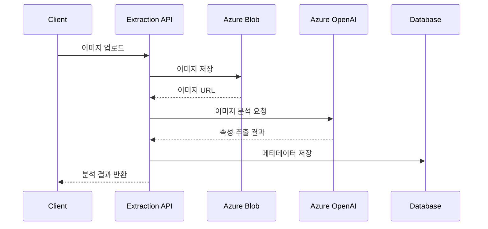

# 이미지 분석 API (Extraction)

AI 기반 옷 이미지 속성 추출 API입니다.

## Base URL

```
/api/extraction
```

## 인증

!!! warning "인증 필요"
    모든 이미지 분석 API는 JWT 토큰 인증이 필요합니다.

## 엔드포인트

### 이미지 업로드 및 분석

옷 이미지를 업로드하고 AI로 속성을 자동 추출합니다.

**Endpoint**
```http
POST /extraction/upload
```

**Request (multipart/form-data)**

| 필드 | 타입 | 필수 | 설명                              |
| ---- | ---- | ---- | --------------------------------- |
| file | file | ✅    | 이미지 파일 (JPG, PNG, GIF, WebP) |

**예제**
```bash
curl -X POST "http://localhost:7071/api/extraction/upload" \
  -H "Authorization: Bearer YOUR_TOKEN" \
  -F "file=@/path/to/shirt.jpg"
```

**Response**
```json
{
  "success": true,
  "image_url": "https://storage.blob.core.windows.net/myclo/users/.../image.jpg",
  "item_id": "789",
  "blob_name": "users/uuid/20240125/image.jpg",
  "attributes": {
    "category": {
      "main": "top",
      "sub": "shirt",
      "confidence": 0.95
    },
    "color": {
      "primary": "blue",
      "secondary": "white",
      "hex": "#0066CC",
      "name": "파란색"
    },
    "pattern": "striped",
    "material": "cotton",
    "style": "casual",
    "fit": "regular",
    "neckline": "collar",
    "sleeve_length": "long",
    "thickness": 2,
    "season": ["spring", "fall"],
    "mood_tags": ["formal", "business", "clean"],
    "features": {
      "buttons": true,
      "pockets": true,
      "print": false
    }
  }
}
```

## 추출되는 속성

### 1. 카테고리 (Category)

**메인 카테고리**
- `top` - 상의
- `bottom` - 하의
- `outer` - 아우터
- `dress` - 원피스
- `shoes` - 신발
- `accessory` - 액세서리

**서브 카테고리 (Top 예시)**
- `t-shirt` - 티셔츠
- `shirt` - 셔츠
- `hoodie` - 후드티
- `sweater` - 스웨터
- `blouse` - 블라우스

**신뢰도 (Confidence)**
- 0.0 ~ 1.0 사이의 값
- 0.8 이상: 높은 신뢰도
- 0.6 ~ 0.8: 중간 신뢰도
- 0.6 미만: 낮은 신뢰도

### 2. 색상 (Color)

```json
{
  "primary": "blue",      // 주 색상
  "secondary": "white",   // 보조 색상
  "hex": "#0066CC",      // HEX 코드
  "name": "파란색",       // 한글 색상명
  "rgb": [0, 102, 204]   // RGB 값
}
```

**지원 색상**
- 기본색: red, blue, green, yellow, black, white, gray, brown
- 파스텔: pastel pink, pastel blue, mint
- 기타: navy, beige, khaki, burgundy

### 3. 패턴 (Pattern)

- `solid` - 무지
- `striped` - 줄무늬
- `checked` - 체크
- `floral` - 꽃무늬
- `dotted` - 도트
- `geometric` - 기하학 무늬
- `animal` - 동물 무늬

### 4. 소재 (Material)

- `cotton` - 면
- `polyester` - 폴리에스터
- `wool` - 울
- `denim` - 데님
- `leather` - 가죽
- `silk` - 실크
- `linen` - 린넨
- `blend` - 혼방

### 5. 스타일 (Style)

- `casual` - 캐주얼
- `formal` - 포멀
- `sporty` - 스포티
- `vintage` - 빈티지
- `street` - 스트릿
- `minimal` - 미니멀

### 6. 핏 (Fit)

- `slim` - 슬림
- `regular` - 레귤러
- `oversized` - 오버사이즈
- `loose` - 루즈

### 7. 두께 (Thickness)

- `1` - 매우 얇음 (여름용)
- `2` - 얇음 (봄/가을)
- `3` - 보통
- `4` - 두꺼움 (겨울용)
- `5` - 매우 두꺼움 (한겨울)

### 8. 계절 (Season)

```json
["spring", "summer", "fall", "winter"]
```

### 9. 무드 태그 (Mood Tags)

```json
["casual", "comfortable", "clean", "modern", "trendy"]
```

## AI 분석 프로세스



## 이미지 요구사항

### 파일 형식
- ✅ JPG/JPEG
- ✅ PNG
- ✅ GIF
- ✅ WebP

### 파일 크기
- 최대: **10MB**
- 권장: **2MB 이하**

### 이미지 품질
- 해상도: 최소 **800x800px** 권장
- 배경: 단색 배경 권장
- 조명: 밝고 균일한 조명
- 각도: 정면 촬영 권장

!!! tip "최적의 분석을 위한 팁"
    - 옷만 촬영 (사람이 입지 않은 상태)
    - 깨끗하고 주름 없는 상태
    - 전체가 보이도록 촬영
    - 배경은 흰색 또는 단색

## 에러 응답

### 400 Bad Request - 파일 없음
```json
{
  "detail": "No file uploaded"
}
```

### 400 Bad Request - 잘못된 파일 형식
```json
{
  "detail": "Invalid file type. Allowed: jpg, jpeg, png, gif, webp"
}
```

### 413 Payload Too Large
```json
{
  "detail": "File size exceeds 10MB limit"
}
```

### 500 Internal Server Error - AI 분석 실패
```json
{
  "detail": "Failed to analyze image"
}
```

## 분석 결과 활용

추출된 속성은 다음과 같이 활용됩니다:

1. **옷장 관리**
   - 자동 카테고리 분류
   - 색상/스타일별 필터링

2. **코디 추천**
   - 색상 조화 분석
   - 스타일 매칭

3. **검색**
   - 속성 기반 검색
   - 유사 아이템 찾기

## 관련 API

- [Wardrobe API](wardrobe.md) - 분석된 아이템 조회
- [Recommendation API](recommendation.md) - 코디 추천
