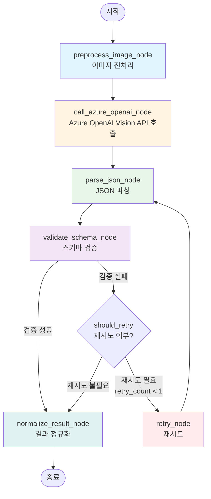
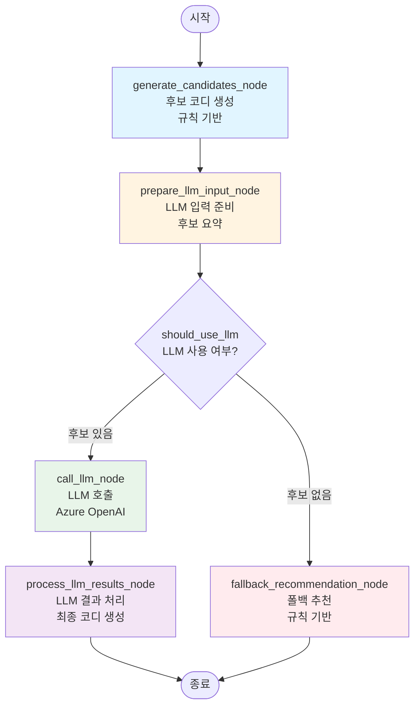
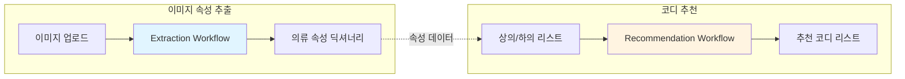

# LangGraph 워크플로우 구조

이 문서는 현재 프로젝트의 LangGraph 워크플로우 구조를 시각화합니다.

## 📁 디렉토리 구조

```
backend/app/ai/
├── workflows/              # 워크플로우 정의
│   ├── extraction_workflow.py      # 이미지 속성 추출
│   └── recommendation_workflow.py  # 코디 추천
├── nodes/                  # 워크플로우 노드
│   ├── extraction_nodes.py
│   └── recommendation_nodes.py
├── schemas/                # 상태 스키마
│   └── workflow_state.py
├── prompts/                # 프롬프트 템플릿
│   ├── extraction_prompts.py
│   └── recommendation_prompts.py
└── clients/                # AI 클라이언트
    └── azure_openai_client.py
```

---

## 🔄 워크플로우 1: 이미지 속성 추출 (Extraction Workflow)

### 상태 스키마 (ExtractionState)
```python
{
    "image_bytes": bytes,           # 입력 이미지
    "raw_response": Optional[str],   # API 원본 응답
    "parsed_json": Optional[Dict],   # 파싱된 JSON
    "errors": List[str],            # 에러 목록
    "retry_count": int,             # 재시도 횟수
    "final_result": Optional[Dict], # 최종 결과
    "confidence": float             # 신뢰도
}
```

### 워크플로우 다이어그램



### 노드 설명

| 노드 | 설명 | 입력 | 출력 |
|------|------|------|------|
| **preprocess_image_node** | 이미지 전처리 | `image_bytes` | 검증된 `image_bytes` |
| **call_azure_openai_node** | Azure OpenAI Vision API 호출 | `image_bytes`, `USER_PROMPT` | `raw_response` |
| **parse_json_node** | JSON 파싱 및 복구 | `raw_response` | `parsed_json` |
| **validate_schema_node** | 스키마 검증 | `parsed_json` | `final_result` (성공 시) 또는 `errors` |
| **retry_node** | 재시도 로직 | `errors`, `retry_count` | 새로운 `raw_response` |
| **normalize_result_node** | 결과 정규화 및 폴백 | `parsed_json` 또는 `errors` | `final_result` |

### 조건부 분기 (should_retry)

```python
def should_retry(state) -> str:
    if state.get("final_result"):
        return "end"  # → normalize
    if state.get("retry_count", 0) >= 1:
        return "normalize"  # 이미 재시도함
    if state.get("errors") and not state.get("final_result"):
        return "retry"  # 재시도 필요
    return "normalize"  # 정규화 후 종료
```

---

## 🎨 워크플로우 2: 코디 추천 (Recommendation Workflow)

### 상태 스키마 (RecommendationState)
```python
{
    "tops": List[Dict],                    # 상의 아이템 리스트
    "bottoms": List[Dict],                 # 하의 아이템 리스트
    "candidates": List[Dict],              # 규칙 기반 후보 코디
    "llm_recommendations": Optional[List], # LLM 추천 결과
    "final_outfits": List[Dict],           # 최종 추천 코디
    "metadata": Dict,                      # 메타데이터 (요약 정보)
    "user_request": Optional[str],          # 사용자 요청 (TPO)
    "weather_info": Optional[Dict],        # 날씨 정보
    "count": int                           # 추천 개수
}
```

### 워크플로우 다이어그램



### 노드 설명

| 노드 | 설명 | 입력 | 출력 |
|------|------|------|------|
| **generate_candidates_node** | 규칙 기반 후보 코디 생성 | `tops`, `bottoms` | `candidates` (점수 정렬) |
| **prepare_llm_input_node** | LLM 입력 데이터 준비 | `candidates` | `metadata` (요약 정보) |
| **call_llm_node** | LLM 호출 (TPO/날씨 고려) | `metadata`, `user_request`, `weather_info` | `llm_recommendations` |
| **process_llm_results_node** | LLM 결과를 최종 코디로 변환 | `llm_recommendations`, `metadata` | `final_outfits` |
| **fallback_recommendation_node** | LLM 실패 시 규칙 기반 추천 | `candidates` | `final_outfits` |

### 조건부 분기 (should_use_llm)

```python
def should_use_llm(state) -> str:
    candidates = state.get("candidates", [])
    if not candidates:
        return "fallback"  # 후보 없음 → 폴백
    return "llm"  # 후보 있음 → LLM 사용
```

---

## 🔗 워크플로우 통합 구조



---

## 📊 노드별 상세 기능

### Extraction Nodes

#### 1. preprocess_image_node
- **기능**: 이미지 전처리 및 검증
- **현재**: 단순 패스 (이미지가 bytes로 들어옴)

#### 2. call_azure_openai_node
- **기능**: Azure OpenAI Vision API 호출
- **프롬프트**: `USER_PROMPT` (extraction_prompts.py)
- **에러 처리**: API 실패 시 `errors`에 기록

#### 3. parse_json_node
- **기능**: API 응답에서 JSON 딕셔너리 추출
- **도구**: `parse_dict_from_text()` (json_parser.py)
- **에러 처리**: 파싱 실패 시 `errors`에 기록

#### 4. validate_schema_node
- **기능**: 추출된 JSON의 스키마 검증
- **도구**: `validate_schema()` (validators.py)
- **성공 시**: `final_result` 설정 및 `confidence` 계산

#### 5. retry_node
- **기능**: 검증 실패 시 재시도
- **조건**: `retry_count < 1`이고 `errors` 존재
- **프롬프트**: `build_retry_prompt()` (에러 정보 포함)

#### 6. normalize_result_node
- **기능**: 최종 결과 정규화 및 폴백
- **경로 1**: `final_result` 존재 → 그대로 반환
- **경로 2**: `parsed_json` 존재 → 정규화 후 반환 (스키마 검증 실패 포함)
- **경로 3**: 모두 실패 → `DEFAULT_OBJ` 반환

### Recommendation Nodes

#### 1. generate_candidates_node
- **기능**: 규칙 기반 후보 코디 생성
- **로직**: 모든 상의×하의 조합 생성
- **점수 계산**: `recommender.calculate_outfit_score()`
- **정렬**: 점수 내림차순, 상위 10개 선택

#### 2. prepare_llm_input_node
- **기능**: LLM 입력 데이터 준비
- **출력**: `metadata`에 요약 정보 저장
  - `tops_summary`: 상의 요약 리스트
  - `bottoms_summary`: 하의 요약 리스트
  - `candidate_tops/bottoms`: 전체 아이템 딕셔너리

#### 3. call_llm_node
- **기능**: LLM을 통한 코디 추천
- **프롬프트 선택**:
  - TPO/날씨 있음 → `build_tpo_recommendation_prompt()`
  - 없음 → `build_recommendation_prompt()`
- **파싱**: `parse_json_from_text()` 사용

#### 4. process_llm_results_node
- **기능**: LLM 결과를 최종 코디 형식으로 변환
- **매핑**: `top_id`, `bottom_id` → 실제 아이템 객체
- **출력**: `final_outfits` 리스트

#### 5. fallback_recommendation_node
- **기능**: LLM 실패 시 규칙 기반 추천
- **입력**: `candidates` (이미 점수 정렬됨)
- **출력**: 상위 `count`개 코디

---

## 🚀 사용 방법

### Extraction Workflow
```python
from app.ai.workflows.extraction_workflow import extract_attributes

# 이미지 바이트로 속성 추출
result = extract_attributes(image_bytes)
```

### Recommendation Workflow
```python
from app.ai.workflows.recommendation_workflow import recommend_outfits

# 코디 추천
outfits = recommend_outfits(
    tops=tops_list,
    bottoms=bottoms_list,
    count=3,
    user_request="회의용",
    weather_info={"temp": 20, "condition": "맑음"}
)
```

---

## 📝 참고사항

- 모든 워크플로우는 **싱글톤 패턴**으로 관리됨
- 상태는 **TypedDict**로 타입 안전성 보장
- 에러는 **graceful degradation** 방식으로 처리
- LLM 실패 시 **규칙 기반 폴백** 제공
